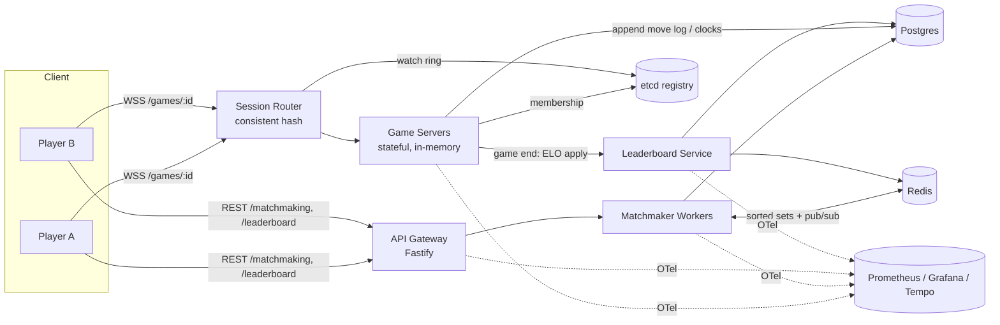

# Production-Grade Distributed Real-Time Chess Platform - like chess.com

A staff-level portfolio build of an online chess platform, engineered the way a
real product at scale would be: skill-based matchmaking, authoritative real-time
gameplay over WebSockets, a global leaderboard, and the full production envelope
around it — microservices, Redis, Postgres, Docker, Kubernetes on GCP, and
end-to-end observability.

The design target is **500K concurrent games (1M live WebSocket connections)** at
peak. We build it phase by phase, and we validate proportionally on a laptop /
small cluster while designing every component so the same code scales to the
target with more replicas.

> **Node.js note:** the whole platform is TypeScript on Node 22 LTS, ESM-first,
> using current production patterns (structured config, graceful shutdown,
> backpressure-aware WebSockets, OpenTelemetry auto-instrumentation).

---

## Documentation

Read in order — each builds on the last.

| #   | Doc                                                | What it covers                                                                                                                 |
| --- | -------------------------------------------------- | ------------------------------------------------------------------------------------------------------------------------------ |
| 00  | [Requirements & Capacity](docs/00-requirements.md) | Functional / non-functional requirements, scale math, capacity estimates                                                       |
| 01  | [High-Level Design](docs/01-hld.md)                | Services, data flows, the three core requirement paths, architecture diagram                                                   |
| 02  | [Low-Level Design](docs/02-lld.md)                 | Schemas, API + WebSocket protocol, matchmaking claim, consistent-hash routing, fencing, latency compensation, leaderboard rank |
| 03  | [Tech Stack](docs/03-tech-stack.md)                | Every technology decision with rationale and the alternative we rejected                                                       |
| 04  | [Project Plan (Phases)](docs/04-project-plan.md)   | **The roadmap.** Phase 0–8 with deliverables and acceptance criteria                                                           |
| 05  | [Observability & SLOs](docs/05-observability.md)   | Metrics, traces, logs, dashboards, alerting, SLOs                                                                              |
| 06  | [Deployment (GCP / K8s)](docs/06-deployment.md)    | Terraform, GKE, Cloud SQL, Memorystore, Helm, CI/CD, autoscaling                                                               |

---

## System at a glance



---

## Repository layout (target)

```
chess/
├── apps/
│   ├── gateway/          # REST edge: auth, matchmaking, leaderboard reads (Fastify)
│   ├── matchmaker/       # Matchmaking workers (Redis sorted sets, atomic claim)
│   ├── session-router/   # Consistent-hash router for game servers
│   ├── game-server/      # Stateful real-time game servers (uWebSockets.js)
│   └── leaderboard/      # ELO apply workers + rank/read API
├── packages/
│   ├── chess-engine/     # Move validation & rules (wraps chess.js)
│   ├── domain/           # Shared entities, value objects, ELO
│   ├── db/               # Drizzle schema, migrations, repositories
│   ├── redis/            # ioredis wrappers + Lua scripts
│   ├── protocol/         # zod DTOs + WS message schemas (shared client/server)
│   ├── config/           # env loading + validation (zod)
│   └── telemetry/        # OpenTelemetry, Prometheus, Pino logger
├── infra/
│   ├── docker/           # Dockerfiles (multi-stage, distroless)
│   ├── compose/          # docker-compose local stack
│   ├── helm/             # Helm charts per service
│   └── terraform/        # GCP IaC (GKE, Cloud SQL, Memorystore, ...)
├── tools/                # load tests (k6), scripts, chaos experiments
└── docs/                 # this documentation
```

## Status

Planning complete. Implementation begins at **Phase 0**. See
[the project plan](docs/04-project-plan.md).
