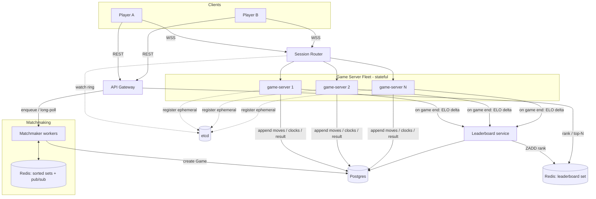
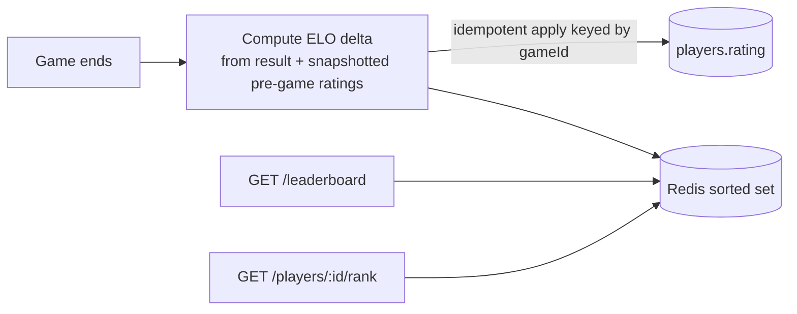

# 01 — High-Level Design

We design in the order a player hits the system: **match → play → rank**. The
real-time game is the heart and gets the most attention.

## Core entities

- **Player** — identity + ELO rating. Rating drives matchmaking _and_ leaderboard.
- **Game** — one game between two players: colors, current position, whose turn,
  clock state, result, and the snapshotted pre-game ratings (so each game's ELO
  delta is self-contained).
- **Move** — one move (from, to, moveNumber, timestamp). Append-only history;
  powers replay/recovery and dispute resolution.
- **MatchRequest** — a request to be matched: player rating + chosen time control.

## Services

| Service            | Statefulness                 | Responsibility                                                                    |
| ------------------ | ---------------------------- | --------------------------------------------------------------------------------- |
| **API Gateway**    | stateless                    | Auth (JWT), REST for matchmaking + leaderboard, holds the matchmaking long-poll   |
| **Matchmaker**     | stateless workers            | Find + atomically claim compatible opponents from the Redis pool, create Games    |
| **Session Router** | stateless                    | Map `gameId → game server` via consistent hashing over live membership            |
| **Game Server**    | **stateful (in-memory)**     | Own the authoritative board + clocks, validate moves, broadcast, persist move log |
| **Leaderboard**    | stateless workers + read API | Apply ELO on game end (idempotent), serve rank + top-N                            |

## Data stores

- **Postgres** — source of truth: `players`, `games`, `moves`, (`match_requests`
  audit). Cloud SQL in prod.
- **Redis** — matchmaking pool (sorted sets + pub/sub) **and** leaderboard sorted
  set. Memorystore in prod, replicated with failover.
- **etcd** — game-server membership registry (ephemeral nodes → consistent-hash ring).

---

## Architecture



---

## 1) Matchmaking (match)

```mermaid
sequenceDiagram
  participant A as Player A
  participant B as Player B
  participant GW as Gateway
  participant MM as Matchmaker
  participant R as Redis

  B->>GW: POST /matchmaking {timeControl} (long-poll held)
  GW->>R: ZADD mm:blitz <ratingB> reqB ; HSET fields
  Note over R: B waits in the pool
  A->>GW: POST /matchmaking {timeControl} (long-poll held)
  GW->>MM: enqueue reqA
  MM->>R: ZRANGEBYSCORE (window around A) → finds reqB
  MM->>R: ZREM mm:blitz reqB  (returns 1 = claimed)
  MM->>PG: create Game(A,B)
  MM->>R: PUBLISH match:reqB {gameId} ; return gameId for reqA
  GW-->>A: 200 {gameId}
  GW-->>B: 200 {gameId}  (long-poll completes via pub/sub)
```

- `playerId` and rating come from the **auth token / Player record**, never the
  request body. Anything a client could lie about to get an easier game is
  server-sourced.
- The POST is a **long-poll**: it stays held until the player is paired (or times
  out). No separate notification channel needed.
- Both players get their answer on the same held request — the one who triggers
  the match and the one already waiting.
- The **claim** must be atomic (two workers can spot the same waiter). Details and
  the widening-window fix for rating extremes are in the [LLD](02-lld.md#matchmaking)
  and [Deep Dive 1](02-lld.md#deep-dive-1--fair-matchmaking-at-scale).

---

## 2) Real-time play — the core

**Decision: stateful game servers, board in memory.** Each live game (board,
whose turn, both clocks — a few hundred bytes, ~2 minutes) lives in the memory of
the server running it. Validating a move is a local, in-memory operation, well
inside the 200 ms budget. We still append every move to a durable log, but that
write is for recovery, not for serving the next move.

We rejected _stateless servers + shared store_ because it puts a network
read+write on the hot path of every move to avoid holding state that is genuinely
cheap to hold. (Full trade-off in [LLD](02-lld.md#why-stateful-game-servers).)

This buys two obligations we solve in the deep dive:

1. both players must land on the same server → **consistent-hash session router**;
2. a crash loses in-flight games → **recovery via move-log replay + generation fence**.

### Move flow

```mermaid
sequenceDiagram
  participant M as Mover
  participant GS as Game Server
  participant PG as Postgres
  participant O as Opponent

  M->>GS: sendMove {from,to,moveNumber}
  GS->>GS: validate vs in-memory board + is it your turn?
  alt legal
    GS->>GS: apply move; stop mover clock, start opponent clock
    GS->>PG: append move (durable) — BEFORE broadcast
    GS-->>M: moveAck {accepted, whiteMs, blackMs}
    GS-->>O: opponentMove {from,to, whiteMs, blackMs}
  else illegal
    GS-->>M: moveAck {accepted:false, reason}
  end
  Note over GS: checkmate/stalemate/draw/flag → write result, gameEnd to both
```

**Persist before broadcast** (the ordering matters): if we acked/broadcast first
and then crashed, recovery would return a board missing a move both players
already saw — exactly the corrupted state NFR-2 forbids. The 200 ms budget
absorbs the few-ms synchronous write, so correctness here is essentially free.

The in-memory board is the live source of truth; Postgres is a recovery log off
the hot path.

---

## 3) Leaderboard (rank)

No new service on the write path — it hangs off game-end:



- Ratings only change at game end, so the leaderboard is naturally fresh.
- **Top-N** is cheap: a btree on `rating` (or `ZREVRANGE 0 49`) walks the first
  entries and stops.
- **A player's own rank** is the hard read: `COUNT(*) WHERE rating > :mine` is
  O(rank) on a btree. The fix is a **Redis sorted set** (`ZREVRANK`, O(log n)) —
  a derived index, never the source of truth. See
  [Deep Dive 4](02-lld.md#deep-dive-4--leaderboard-correct--fast-at-10m).

A rating is a **derived total over finished games**, so a crash at game end isn't
scary: the result is durable on the Game row, and both the `players.rating`
column and the Redis set are just idempotent, rebuildable views over it.

---

## Bottlenecks → deep dives

The high-level design works. The [LLD](02-lld.md) then digs into the four things
that make it _production-grade at scale_:

1. **Fair matchmaking at scale** — race-free atomic claim + widening windows.
2. **Scaling stateful game servers to 500K games** — consistent-hash routing,
   membership registry, crash recovery, generation fencing.
3. **Fair clocks despite uneven latency** — server-authoritative clock with
   RTT-based latency compensation (and its abuse cap).
4. **Leaderboard correct & fast at 10M players** — exact rank via Redis sorted set,
   idempotent derived apply, reconciliation.
