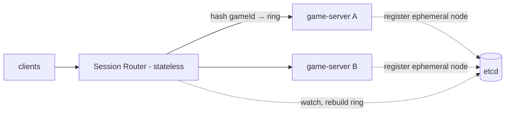
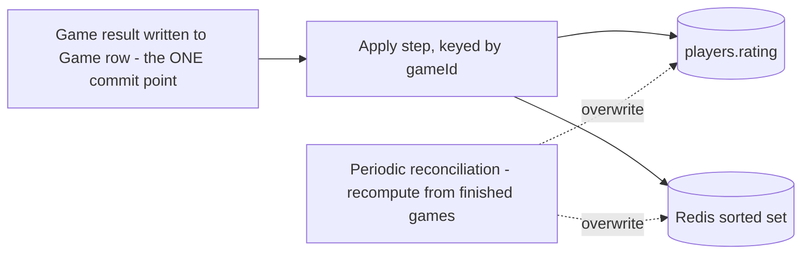

# 02 — Low-Level Design

Concrete schemas, contracts, and algorithms. This is where the four deep dives
live.

## Contents

- [Data model (Postgres)](#data-model-postgres)
- [REST API](#rest-api)
- [WebSocket protocol](#websocket-protocol)
- [Why stateful game servers](#why-stateful-game-servers)
- [Deep Dive 1 — Fair matchmaking at scale](#deep-dive-1--fair-matchmaking-at-scale)
- [Deep Dive 2 — Scaling stateful game servers](#deep-dive-2--scaling-stateful-game-servers)
- [Deep Dive 3 — Fair clocks under uneven latency](#deep-dive-3--fair-clocks-under-uneven-latency)
- [Deep Dive 4 — Leaderboard correct & fast at 10M](#deep-dive-4--leaderboard-correct--fast-at-10m)

---

## Data model (Postgres)

```sql
CREATE TABLE players (
  player_id     UUID PRIMARY KEY DEFAULT gen_random_uuid(),
  username      TEXT UNIQUE NOT NULL,
  rating        INTEGER NOT NULL DEFAULT 1500,
  games_played  INTEGER NOT NULL DEFAULT 0,
  created_at    TIMESTAMPTZ NOT NULL DEFAULT now(),
  updated_at    TIMESTAMPTZ NOT NULL DEFAULT now()
);
-- Top-N leaderboard walks this index and stops.
CREATE INDEX idx_players_rating ON players (rating DESC);

CREATE TABLE games (
  game_id        UUID PRIMARY KEY DEFAULT gen_random_uuid(),
  white_id       UUID NOT NULL REFERENCES players(player_id),
  black_id       UUID NOT NULL REFERENCES players(player_id),
  time_control   TEXT NOT NULL,                 -- e.g. 'blitz-3-2'
  white_ms       INTEGER NOT NULL,              -- remaining clock (authoritative)
  black_ms       INTEGER NOT NULL,
  turn           CHAR(1) NOT NULL,              -- 'w' | 'b'
  status         TEXT NOT NULL DEFAULT 'active',-- active | finished
  result         TEXT,                          -- '1-0' | '0-1' | '1/2-1/2'
  end_reason     TEXT,                          -- checkmate | stalemate | draw | flag | resign
  white_rating_start INTEGER NOT NULL,          -- snapshot → self-contained ELO delta
  black_rating_start INTEGER NOT NULL,
  generation     INTEGER NOT NULL DEFAULT 0,    -- fencing token (Deep Dive 2)
  created_at     TIMESTAMPTZ NOT NULL DEFAULT now(),
  updated_at     TIMESTAMPTZ NOT NULL DEFAULT now()
);
CREATE INDEX idx_games_active ON games (status) WHERE status = 'active';

CREATE TABLE moves (
  game_id      UUID NOT NULL REFERENCES games(game_id),
  move_number  INTEGER NOT NULL,
  ply          INTEGER NOT NULL,                -- half-move index (0-based)
  san          TEXT NOT NULL,                   -- 'Nf3'
  uci          TEXT NOT NULL,                   -- 'g1f3'
  clock_ms     INTEGER NOT NULL,               -- mover's remaining time after move
  created_at   TIMESTAMPTZ NOT NULL DEFAULT now(),
  PRIMARY KEY (game_id, ply)                    -- append-only, ordered replay
);

-- match_requests is an audit/analytics table; the live pool is in Redis.
CREATE TABLE match_requests (
  request_id   UUID PRIMARY KEY,
  player_id    UUID NOT NULL REFERENCES players(player_id),
  rating       INTEGER NOT NULL,
  time_control TEXT NOT NULL,
  status       TEXT NOT NULL,                   -- pending | matched | expired
  game_id      UUID REFERENCES games(game_id),
  enqueued_at  TIMESTAMPTZ NOT NULL DEFAULT now(),
  resolved_at  TIMESTAMPTZ
);
```

We store **moves as SAN/UCI**, never a serialized board — the board is always
re-derivable by replaying moves onto the start position (recovery is replay).

---

## REST API

```
POST /matchmaking                       → { gameId } | 408 timeout
  Body: { timeControl }                 # playerId + rating from JWT, never body
  Long-poll: held open until paired or timeout (~30s, then widen/expire)

GET  /leaderboard?cursor&limit          → Player[]     (cursor pagination)
GET  /players/:playerId/rank            → { rank, rating }

POST /auth/login  /auth/register        → { jwt }      (supporting)
GET  /games/:gameId                      → Game         (reconnect bootstrap)
GET  /healthz  /readyz                    (probes)
GET  /metrics                            (Prometheus)
```

**Auth rule (repeat because it's a red flag if missed):** identity and rating are
read server-side from the Player record. The client never sends `playerId` or
`rating`.

---

## WebSocket protocol

```
WSS /games/:gameId        (JWT in connect params; router places both players
                           on the same game server via consistent hashing)

Client → Server
  sendMove   { from, to, moveNumber, promotion? }
  resign     { }
  offerDraw  { } / acceptDraw { }
  ping       { t }                       # app-level, in addition to WS ping/pong

Server → Client
  gameState    { fen, turn, whiteMs, blackMs, moveNumber }   # sent on (re)connect
  moveAck      { accepted, reason?, whiteMs, blackMs }
  opponentMove { from, to, san, whiteMs, blackMs }
  gameEnd      { result, endReason, ratingDelta }
  clockSync    { whiteMs, blackMs }      # periodic, for UI smoothing
  pong         { t, serverT }
```

Message schemas are defined once in `packages/protocol` with **zod** and shared by
client and server, so the contract is typed on both ends.

---

## Why stateful game servers

| | Stateless + shared store | **Stateful + in-memory (chosen)** |
|---|---|---|
| Move validation | network read+write per move | local, microseconds |
| Hot-path cost | 2 network hops inside 200 ms | 1 async persist off hot path |
| Routing | any server handles any move | both players must co-locate |
| Crash | nothing lost (state external) | in-flight games need recovery |
| Cost of the state | pay to externalize ~hundreds of bytes | free — it lives in process |

Chess state is tiny and short-lived, and we already write a move log for
recovery, so the "hard parts" of stateful (routing + crash) are solvable and
cheap. Externalizing would only pay off if per-game state were large or
long-lived — which chess is not.

---

## Deep Dive 1 — Fair matchmaking at scale

**Problem.** ~30K req/s at peak. A match is a *range search* for the nearest
compatible rating in the same time control, then a *read-modify-write claim*
before another worker grabs the opponent. The mid-rating band is thick, so the
same waiters are candidates for huge numbers of incoming requests at once →
structural contention. And rating extremes have almost no online peers.

### The pool: Redis sorted set per time control

```
# member = requestId, score = rating
ZADD mm:blitz-3-2 1512 req_8a3f
HSET mmreq:req_8a3f playerId 42 rating 1512 status pending enqueuedAt 1718900000
```

### Find — range-by-score, widened by wait time

```
# base: ±50 around the incoming rating
ZRANGEBYSCORE mm:blitz-3-2 1462 1562
# widen with age: window = 50 + 8 * ageSeconds
#   after 30s → ±290 → ZRANGEBYSCORE mm:blitz-3-2 1222 1802
```

A light background pass re-scans waiters and applies their widened window, so a
lonely 2700 starts looking for near-peers and gradually opens up — no separate
structure for the extremes.

### Claim — atomic, lock-free

The claim is the contention point. `ZREM` returns how many members it actually
removed, so **whoever's `ZREM` returns 1 owns the opponent**; a worker that gets 0
knows they were beaten and moves to the next candidate. No lock; no double-booking.

```lua
-- claim_and_pair.lua  (atomic on one Redis node)
-- KEYS[1]=pool  ARGV[1]=candidateReqId
local removed = redis.call('ZREM', KEYS[1], ARGV[1])
if removed == 1 then return 1 else return 0 end
```

We run the *find compatible + claim self + claim opponent + create game* as a
small atomic step (Lua) so a request can't claim an opponent while itself being
claimed. Roughly **~4 Redis ops per request**, matching the capacity math.

### Notify the waiter (cross-process)

The paired waiter is holding a long-poll on some gateway node, almost certainly a
different process from the claiming worker:

```
PUBLISH match:req_8a3f {"gameId":"..."}    # worker publishes
# the gateway node holding req_8a3f's long-poll is SUBSCRIBEd → completes it
```

**Caveat:** if the waiter's connection is already gone (long-poll dropped/timed
out before the claim), the pairing is void — the worker `ZADD`s the *other*
player back into the pool so nobody is orphaned on a match the peer never got.

### Do we shard the pool? — No, and prove it

```
30K req/s × 4 ops ≈ 120K ops/s ; hottest time control ≈ 40% ≈ 50K ops/s
single-threaded Redis ≈ low hundreds of K sorted-set ops/s
→ hottest key < 1/3 of one node, 4–5× headroom; pool < 100 MB
```

Sharding buys only more moving parts + band-edge bugs (near-equal players in
different buckets). Reach for it only if one time control grows several× past
peak. **Naming the textbook sharded answer, then disproving it with numbers, is
the staff signal.**

### Redis HA

Single point of failure for the pool → run replicated with automatic failover
(Sentinel or managed Redis Cluster). Pending requests are cheap and ephemeral, so
even a failover that drops the in-flight pool just has clients re-submit; the
queue refills in seconds. Far lower bar than game state.

---

## Deep Dive 2 — Scaling stateful game servers

500K games = 1M connections + 500K in-memory sessions across a fleet of dozens to
low-hundreds of pods. Two hard parts: **co-locate both players**, and **survive a
crash**.

### Routing — consistent hashing + membership registry



- A thin **stateless session router** maps `gameId → server` with **consistent
  hashing**, so both players go to the same box and validation/clocks stay local.
- Each game server registers an **ephemeral node** in **etcd** (auto-deletes if it
  stops heartbeating). The router watches etcd and rebuilds its ring on any
  membership change. Lookup is a pure function of `gameId` + current membership.
- Consistent hashing means add/remove a node remaps only a **small slice** of
  games; a dead server drops out of the ring on its own.

### Survival — recovery is just replay

We already have everything: every move is appended **before** broadcast, and the
Game row carries clocks/turn/result. So a replacement server:

1. loads the Game row (clocks, turn, generation),
2. replays the game's moves to rebuild the board in memory (~a few hundred bytes,
   microseconds),
3. bumps `generation` as the new owner.

No separate board snapshot, no snapshot-freshness reasoning.

### The fence — the easy thing to miss

A replaced-but-still-alive server (network partition) must not keep writing to a
game the ring moved on. Every write (move append + clock update, one transaction)
is guarded on a **generation** token:

```sql
UPDATE games
   SET white_ms = :white_ms, black_ms = :black_ms, turn = :turn,
       generation = :gen, updated_at = now()
 WHERE game_id = :id AND generation <= :gen;   -- zombie at old gen fails silently
```

A zombie holding the old generation fails the predicate; its writes — including
any move it appends in the same transaction — are dropped. It cannot reanimate a
reassigned game.

### Failover walkthrough

1. Server S owns game G at generation N, crashes → its ephemeral etcd node expires.
2. Router rebuilds the ring without S; successor of `hash(G)` is S'.
3. Clients detect the dropped socket, reconnect; router sends them to S'.
4. S' loads G's row, replays moves, reads gen N, bumps to N+1 as new owner.
5. A delayed write from partitioned-but-alive S lands at gen N, fails
   `generation <= N+1`... wait — it fails because S carries N while the row is now
   N+1, so `N <= N+1` is true but S writes `generation = N`, moving it *backwards*;
   we additionally require the new owner's writes to carry the **current** gen, and
   S's stale-gen write loses because S' already advanced the row. Net: the zombie's
   mutation is rejected. (Implementation guards on `generation < :gen` for
   ownership handoff and `= :gen` for steady-state writes.)

### Player disconnect ≠ server failure

The clock rule **flips**:
- **Server failure** → pause the clock during the reconnect blip (consistency
  over availability). Recovery is a row read + replaying a few hundred bytes.
- **Player disconnect** (closed tab) → clock **keeps running**, maybe a short
  grace window; fail to reconnect in time and you flag, just like over the board.
  Pausing on every disconnect would let someone escape a losing position.

### Would a framework do this? — Yes, and it changes nothing about the answer

Akka Cluster Sharding (what Lichess runs live games on) or Microsoft Orleans
virtual actors make placement a coordinator-owned directory, so scale-up moves no
healthy games. But for chess you still recover by replaying the move log and still
want a fence (Orleans ships a strongly-consistent grain directory for exactly the
double-write our generation guard handles). The hand-rolled consistent-hash router
is genuinely fine; reach for a framework only if already in that ecosystem. The
one wart of hashing: scale-up during peak remaps a slice of healthy games (a brief
reconnect) — a small price for chess.

---

## Deep Dive 3 — Fair clocks under uneven latency

The server owns the clock and can only start/stop when a move actually *arrives*,
so each player's network latency comes out of their own clock. A 200 ms-distant
player pays ~170 ms more per move than a 30 ms player → ~7 s bled over a 40-move
blitz game. Systematic geographic disadvantage.

- **Rejected — client-managed clock:** a modified client just lies; timers drift
  and disagree on who flagged. The clock is authoritative-only.
- **Rejected — server-authoritative, no compensation:** fixes cheating, not
  fairness; the round trip still comes out of the mover's budget.
- **Chosen — server-authoritative + latency compensation.**

### Mechanics

No per-game timer. Store per player `remaining_ms` and `last_start_ts` (from a
**monotonic** clock); compute elapsed on demand; write only on a move.

Continuously measure RTT via WebSocket ping/pong (independent of moves — a player
may think 30 s between moves). Keep a **rolling median** (robust to spikes). On a
move, estimate one-way transit `median_rtt / 2` and credit it back before charging
think time.

```
200 ms player: median RTT ≈ 100 ms → credit ≈ 50 ms/move before charging.
Most of the ~7 s systematic penalty disappears. Fair on average, not per-move.
```

### The abuse cap — be honest

A client can inflate its own RTT by dragging out pong responses; the server can't
distinguish a stalled pong from a slow link (nothing is forged — it just answers
slowly). Defense isn't perfect detection, it's a **cap**: limit how much any
single move can claw back (ceiling ~100 ms). Even a client gaming RTT can't turn a
slow link into meaningful free time. Compensation is best-effort by design; the
goal is leveling geography, not defeating a determined cheater at the margin.
UI smooths the brief disagreement between local display and authoritative time.

---

## Deep Dive 4 — Leaderboard correct & fast at 10M

Two very different reads:
- **Top-N** — solved: btree on `rating` (or `ZREVRANGE 0 49`) + cache a page that
  barely moves.
- **My rank** — the hard one. `COUNT(*) WHERE rating > :mine` is **O(rank)** on a
  btree (sorted order, but not position), worst for the mid-pack majority, and the
  most common personalized read.

### Option A — bucketed counts (approximate)

Keep counts per rating band (~10-pt buckets, a few hundred total); rank = sum of
higher bands, optionally interpolated within the band. Constant-work lookup, few
hundred integers. Answer is "~4,200th". Great when approximate is fine — name it
as the pragmatic middle.

### Option B (chosen) — Redis sorted set (exact)

```
member = playerId, score = rating (+ fractional last-updated tiebreak)
ZREVRANK <playerId>     → exact rank,   O(log n)
ZREVRANGE 0 49          → top page,     O(log n)
```

The skiplist behind a sorted set is the order-statistics structure a plain btree
isn't. We already run Redis, so it's a natural addition, not new infra.

```
10M members ≈ ~1 GB, single instance, no sharding (global ranking wants one set).
Write rate = game-end rate ≈ 4K games/s × 2 ≈ 8K ZADD/s → trivial for Redis.
Durable with AOF, but a lost/drifted set just gets rebuilt (it's derived).
Tiebreak baked into score so pagination doesn't wobble on equal ratings.
```

### Landing the rating change durably (idempotent, derived)

A rating is a **function of completed games** (each game snapshots pre-game
ratings, so its delta is self-contained) — no precious in-memory value.



- The Game result write is the single commit point.
- The apply step fans the ELO delta into `players.rating` and the sorted set,
  **keyed on gameId → idempotent**: replaying the same game is a no-op, so a retry
  after a half-finished update corrects rather than double-counts.
- Periodic **reconciliation** recomputes from finished games and overwrites both;
  worst case, rebuild the whole set from scratch.

That's why a crash at game end isn't scary: the result is durable, and the
leaderboard is just a rebuildable view over it.
