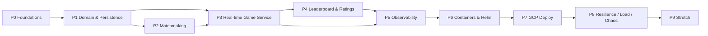

# 04 — Project Plan (Phases)

The roadmap. We build in the order a player hits the system, standing up the
production envelope (observability, containers, deploy) once there's something
real to run through it. Each phase has **deliverables** and **acceptance
criteria** — a phase is "done" only when its acceptance criteria pass.

## Principles

- **Vertical slices.** Each feature phase is playable end-to-end before we move on
  — no big-bang integration.
- **Invariants proven, not assumed.** The correctness properties (race-free claim,
  crash recovery, fencing, latency comp) get dedicated tests, because they must
  hold at any scale.
- **Design for 1M, validate proportionally.** Same code; more replicas. Phase 8
  validates against the [capacity math](00-requirements.md#scale--capacity-estimation).
- **Ship the envelope early enough to use it.** Observability lands right after the
  core game (Phase 5) so we debug the hard scale/chaos work _with_ traces and
  dashboards, not without.

## Dependency graph

---

## Phase 0 — Foundations & scaffolding

Stand up the monorepo and the local dev loop so every later phase has a home.

**Deliverables**

- pnpm workspace + Turborepo; TS strict base config; ESLint + Prettier; git hooks (lefthook).
- Package skeletons: `config` (zod env loading), `telemetry` (Pino + OTel bootstrap),
  `protocol` (zod DTOs), `domain`, `chess-engine`, `db`, `redis`.
- App skeletons (health server only): `gateway`, `matchmaker`, `session-router`,
  `game-server`, `leaderboard`.
- `infra/compose`: docker-compose with Postgres, Redis, etcd, Prometheus, Grafana, Tempo.
- CI (GitHub Actions): install → lint → typecheck → test → build, with Turbo cache.
- Root scripts: `pnpm dev` (compose up + watch), `pnpm build`, `pnpm test`.

**Acceptance**

- `pnpm dev` brings the whole local stack up; every app answers `/healthz`.
- CI is green on an empty-but-typed repo.

---

## Phase 1 — Domain & persistence

The rules engine and the source of truth. No networking yet.

**Deliverables**

- `chess-engine`: legal-move generation, check/checkmate/stalemate/draw detection,
  FEN in/out, apply-move, replay-from-moves. Thin wrapper over chess.js with our
  own typed API.
- `db`: Drizzle schema for `players`, `games`, `moves`, `match_requests`;
  drizzle-kit migrations; pooled connection; repositories with the transactional
  **move-append + clock-update + generation-guard** write.
- `domain`: ELO module (pure), time-control parsing, value objects.
- Seed script (players with a rating distribution for realistic matchmaking/leaderboard).

**Acceptance**

- Engine unit tests pass, including **perft** counts at depth 1–4 from the start
  position (proves move-gen correctness) and mate/stalemate fixtures.
- Migrations apply cleanly; repository integration tests pass against real Postgres
  (Testcontainers), including the generation-guarded UPDATE rejecting a stale gen.
- ELO tests match known win/loss/draw deltas.

---

## Phase 2 — Matchmaking

First real feature: two players get paired and a Game is created.

**Deliverables**

- `gateway`: `POST /matchmaking` with JWT auth (identity + rating server-sourced),
  implemented as a **long-poll** held until paired or timeout; `GET /games/:id`.
- `matchmaker`: Redis sorted-set pool per time control; find (range-by-score) +
  **atomic claim** (`ZREM`-returns-1 / Lua `claim_and_pair`); widening-window
  background pass for rating extremes.
- Pub/sub `match:<reqId>` notification; gateway completes the held long-poll;
  void-and-requeue path when the waiter's connection is gone.
- Game creation (both players, snapshot ratings, initial clocks) on match.

**Acceptance**

- Two clients on the same time control get matched and receive the same `gameId`.
- **Concurrency test:** N workers hammering a hot mid-band waiter → the player is
  booked into exactly one game (no double-booking); losers retry cleanly.
- A lonely extreme rating widens over time and eventually matches (or expires with
  a clear response).
- Match p95 wait time recorded (baseline for later SLOs).

---

## Phase 3 — Real-time game service (the heart)

Stateful, in-memory gameplay with the router, recovery, fencing, and fair clocks.
This is the largest phase; split into sub-milestones.

**3a — Gameplay core**

- `game-server`: WS endpoint, in-memory game state (board, turn, both clocks),
  `sendMove` validation against the engine, `moveAck` / `opponentMove` / `gameEnd`.
- **Persist-before-broadcast**: append move (durable) before acking/broadcasting.
- Server-authoritative clocks: monotonic, computed on demand, written only on a move.
- Game end on checkmate/stalemate/draw/flag/resign → write result + `gameEnd`.

**3b — Routing & fleet**

- `session-router`: consistent-hash ring; game servers register **ephemeral etcd
  nodes**; router watches etcd and rebuilds the ring; both players routed to the
  same server.

**3c — Recovery & fencing**

- Crash recovery: replacement server loads Game row + replays moves to rebuild
  board; bumps `generation`.
- **Generation fence** on every write so a zombie (partitioned-but-alive) server
  can't mutate a reassigned game.
- Clock rules: **pause** on server failure; **keep running** (with grace) on player
  disconnect. Reconnect bootstrap via `gameState`.

**3d — Fair clocks**

- WS ping/pong RTT sampling, rolling **median**; credit `median_rtt/2` on each move
  with a **~100 ms cap**; UI-smoothing `clockSync`.

**Acceptance**

- A full game is playable end-to-end between two clients; illegal moves rejected.
- Move propagation **p99 < 200 ms** locally.
- **Kill a game server mid-game** → clients reconnect, game resumes from replay,
  clock paused during the blip; result unaffected.
- **Fencing test:** a simulated zombie write at the old generation is rejected;
  no corruption.
- **Latency test:** with injected asymmetric latency (`tc netem`), the distant
  player's systematic clock penalty is materially reduced vs no-compensation, and
  the claw-back cap holds against a stalled-pong client.

---

## Phase 4 — Leaderboard & ratings

Rank the players once games end.

**Deliverables**

- ELO **apply step** on game end: idempotent, keyed by `gameId`, fanning the delta
  into `players.rating` and the Redis **leaderboard sorted set** (with tiebreak in
  the score).
- `GET /leaderboard?cursor&limit` (top-N via `ZREVRANGE` / btree, cached) and
  `GET /players/:id/rank` (exact via `ZREVRANK`).
- **Reconciliation** job: recompute ratings from finished games, overwrite both
  stores; full **rebuild-from-games** path.

**Acceptance**

- Ratings update shortly after a game ends; leaderboard reflects it.
- Own-rank read is exact and O(log n) fast at 10M seeded players.
- **Idempotency test:** replaying the same game-end apply is a no-op (no
  double-count). **Reconciliation test:** deliberately drift Redis, run recon,
  values converge to Postgres truth.

---

## Phase 5 — Observability & SLOs

Now that the hard parts exist, instrument them before we scale/break them.

**Deliverables** (detail in [05-observability](05-observability.md))

- OTel traces spanning gateway → matchmaker → game-server → leaderboard, with
  correlation IDs in Pino logs.
- Prometheus **RED** metrics per service + **domain metrics**: matchmaking wait
  time, move latency histogram (p50/p99), active games, live connections, clock
  compensation applied, ELO apply lag, reconciliation drift.
- Grafana dashboards per service + a system overview.
- SLOs + Alertmanager burn-rate rules (move p99, availability, match wait).
- Proper `/healthz` (liveness) vs `/readyz` (readiness, incl. dependency checks)
  and graceful shutdown (drain WS, deregister from etcd).

**Acceptance**

- A single move is traceable across services; dashboards show live signal under a
  small synthetic load; a deliberately breached SLO fires an alert in test.

---

## Phase 6 — Containers & Helm

Package everything reproducibly; run on local Kubernetes.

**Deliverables**

- Multi-stage Dockerfiles per app → **distroless**, non-root, healthchecks.
- Helm chart per service; shared library chart; env values (`local`, `staging`, `prod`).
- Local k8s (kind/minikube): full stack via Helm, including stateful deps or their
  cluster equivalents; `PodDisruptionBudget`, resource requests/limits, probes.
- Game-server pods configured for sticky WS (headless service / session affinity).

**Acceptance**

- `helm install` brings the whole platform up on kind; a game is playable through
  the in-cluster ingress; rolling a game-server pod triggers clean recovery.

---

## Phase 7 — GCP deployment

The real thing on GKE.

**Deliverables** (detail in [06-deployment](06-deployment.md))

- **Terraform**: GKE cluster, Cloud SQL (Postgres + read replica), Memorystore
  (Redis HA), Artifact Registry, VPC/networking, Workload Identity, Secret Manager.
- CI/CD: GitHub Actions builds + pushes images to Artifact Registry, deploys via
  Helm to GKE; migrations run as a pre-deploy Job.
- Ingress: HTTPS LB (managed cert) for REST; TCP proxy with session affinity for WS.
- **HPA** (CPU/conns) + **KEDA** (Redis queue depth for matchmaker); PDBs; node
  pools sized for connection density.
- Secrets via Secret Manager + External Secrets; no static keys in pods.

**Acceptance**

- System is live on GKE behind TLS; a game is playable over the internet.
- A rolling deploy completes with **zero dropped games** (drain + recovery).
- HPA/KEDA scale a service up under synthetic load and back down after.

---

## Phase 8 — Resilience, load & chaos

Prove the design against its targets and its failure modes.

**Deliverables**

- **k6** suites: matchmaking throughput ramp, concurrent-games soak, WS connection
  density; extrapolate to the [capacity math](00-requirements.md#scale--capacity-estimation).
- **Chaos experiments**: kill game-server pods under load (recovery), partition a
  game server (fencing), Redis primary failover (pool refills, leaderboard
  rebuilds), Cloud SQL failover, network latency injection (clock fairness holds).
- Capacity report vs targets; tuning of window-widening, per-node game count, HPA
  thresholds, connection limits.
- **Runbooks** for each failure mode.

**Acceptance**

- Sustains a scaled-down-but-proportional target (e.g. tens of thousands of
  connections on the test cluster) within SLO; documented extrapolation to 1M.
- Every chaos experiment recovers within its runbook's stated objective; move p99
  stays < 200 ms except during the intended reconnect blip.

---

## Phase 9 — Stretch / below the line

Only after the core is solid. Each is a distinct subsystem, explicitly optional.

- **Fair-play / anti-cheat** — offline ML + behavioral analysis (engine-match rate,
  move-time patterns, accuracy vs rating). Separate from the real-time path.
- **Spectating popular games** — read fan-out via pub/sub tree / CDN-style tree;
  never hung off the authoritative game server; hundreds-of-ms lag acceptable.
- **Game archive** — every finished game kept forever; moves-as-string enables
  prefix-range opening explorer; columnar/search store (Elasticsearch) for
  cross-archive aggregation. Off the OLTP path.
- **Premoves in bullet** — queue-and-fire on opponent move; validate/discard
  cleanly; near-zero clock cost.

---

## Milestones

| Milestone                    | Phases | Outcome                                                  |
| ---------------------------- | ------ | -------------------------------------------------------- |
| **M1 — Playable core**       | 0–4    | Match → real-time game → leaderboard, working locally    |
| **M2 — Production envelope** | 5–7    | Observable, containerized, live on GKE with autoscaling  |
| **M3 — Proven at scale**     | 8      | Load + chaos validated against targets, runbooks written |
| **M4 — Depth**               | 9      | Stretch subsystems as time allows                        |
