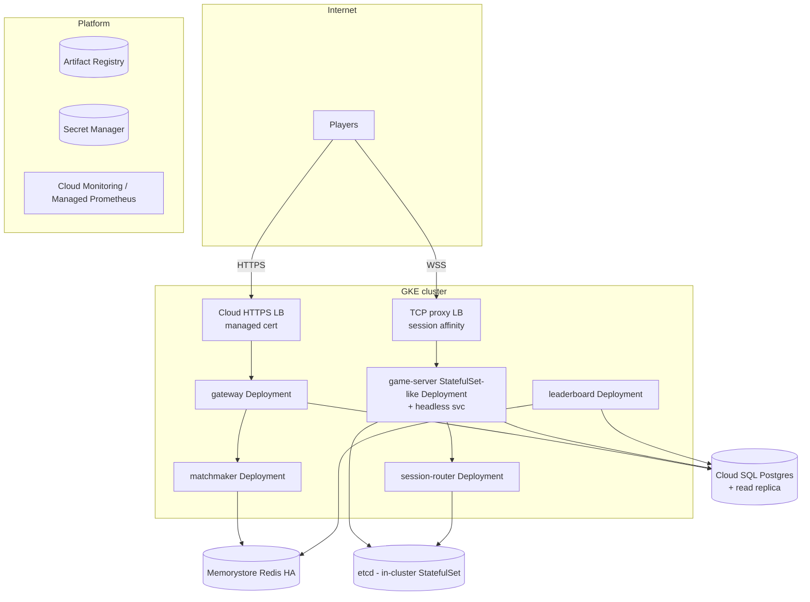
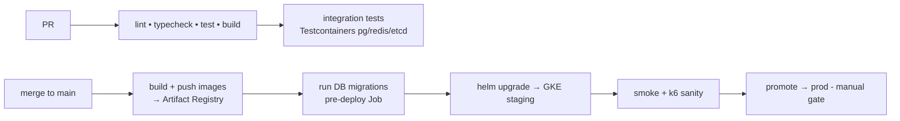

# 06 — Deployment (GCP / Kubernetes)

How the platform runs in production on GCP, and how code gets there. Built in
Phases 6–7, exercised in Phase 8.

## Topology on GKE

### Why two load balancers
- **REST** (gateway) → standard **HTTPS L7 LB** with managed TLS.
- **WebSockets** (game servers) → **TCP proxy / passthrough LB with session
  affinity**, because a game socket must stay pinned to the pod that holds the
  game in memory. The session router does game-level placement; the LB affinity
  keeps the reconnect landing sensibly. (On reconnect the router re-resolves via
  the consistent-hash ring, so affinity is an optimization, not the correctness
  mechanism — the ring is.)

## Infrastructure as Code (Terraform)

`infra/terraform` provisions, per environment (`staging`, `prod`):

- **GKE** cluster + node pools. A dedicated node pool for **game-server** pods
  sized for connection density (more memory/network, fewer noisy neighbors);
  general pool for stateless services.
- **Cloud SQL for PostgreSQL** (HA) + a **read replica** dedicated to leaderboard
  top-N reads.
- **Memorystore for Redis** (Standard/HA tier) — matchmaking pool + leaderboard
  set. (Full-control alternative: self-hosted Redis + Sentinel StatefulSet.)
- **Artifact Registry** repo for images.
- **VPC**, subnets, private service access for Cloud SQL/Memorystore, firewall.
- **Workload Identity** bindings (pods assume GCP SAs — no static keys).
- **Secret Manager** secrets + IAM.

State in a GCS backend; environments as workspaces or separate state.

## Kubernetes objects (Helm)

Per service (`infra/helm/<service>`):
- `Deployment` (game-server is a Deployment with stable identity semantics via a
  headless Service; it does **not** need a real StatefulSet because state is
  recoverable via replay, not persistent volumes).
- `Service` (ClusterIP; headless for game-server).
- `HorizontalPodAutoscaler`.
- `PodDisruptionBudget` (protects the fleet during node drains).
- `ConfigMap` (non-secret config) + `ExternalSecret` (from Secret Manager).
- Probes: `readinessProbe` → `/readyz`, `livenessProbe` → `/healthz`,
  `preStop` hook → graceful drain (deregister etcd, drain WS).
- Resource `requests`/`limits` tuned per service (game-server memory-heavy).

Cluster-wide: **etcd** StatefulSet (registry), OTel Collector DaemonSet,
Prometheus/Grafana/Tempo/Loki (or GCP Managed Prometheus + Cloud Monitoring),
KEDA, External Secrets Operator.

## Autoscaling

| Service | Scaler | Signal |
|---|---|---|
| gateway | HPA | CPU + RPS |
| matchmaker | **KEDA** | Redis pool depth (`matchmaking_pool_size`) — scale to the queue, not CPU |
| game-server | HPA | `ws_connections` / `active_games` per pod (custom metric) + memory |
| leaderboard | HPA | CPU + apply-queue lag |

**Scale-up caveat (from Deep Dive 2):** adding game-server pods during peak remaps
a slice of healthy games onto new nodes (a brief reconnect). We scale the fleet
proactively and gradually, and PDBs + graceful drain keep it a blip, not an
outage.

## CI/CD (GitHub Actions)

- Images tagged by git SHA; Helm values reference the tag.
- **Migrations run as a Kubernetes Job before the rollout**, using expand/contract
  (backward-compatible) migrations so old and new pods coexist during the rolling
  deploy — required for zero-downtime.
- Rollout strategy: `RollingUpdate` with `maxUnavailable: 0` for game-server so
  capacity never dips below demand; drained pods hand games off via recovery.
- Rollback: `helm rollback` (and Terraform is the source of truth for infra).

## Zero-downtime deploy checklist (the hard one: game servers)

1. New game-server pods come up, register in etcd, pass `/readyz`.
2. HPA/rollout brings old pods down one at a time; each `preStop` **deregisters
   from etcd** and **drains** — the ring reshapes, affected games reconnect and
   recover via replay, clocks paused during the blip.
3. Fencing guarantees a draining-but-still-alive pod can't corrupt a game the ring
   already moved.
4. Result: rolling deploys complete with **zero dropped games** (Phase 7
   acceptance).

## Secrets & security posture

- **Workload Identity** — pods authenticate to GCP as SAs; no key files.
- **Secret Manager** + External Secrets — DB creds, JWT signing keys synced as k8s
  Secrets.
- Distroless, non-root containers; read-only root FS where possible;
  NetworkPolicies restricting east-west traffic to expected paths.
- TLS terminated at the LB; internal mTLS optional (service mesh) — out of scope
  for the portfolio unless time allows.

## Cost / scale note for the portfolio

The design target is 1M connections; the portfolio runs a **small GKE cluster**
and validates proportionally (Phase 8). Everything here is written so the *same*
manifests scale to the target by raising replica counts and node-pool sizes — the
architecture doesn't change between the demo cluster and the 1M-connection target.
